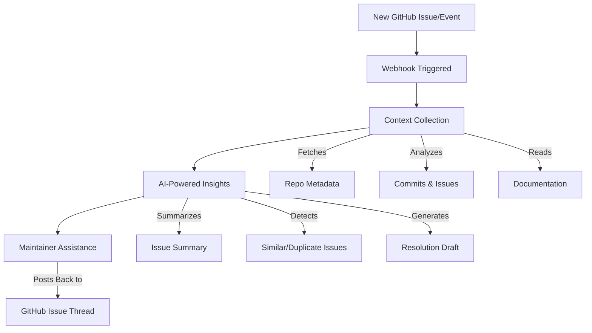

# ⚡ Git.AI – The AI Copilot for Maintainers  

Maintaining open-source projects is tough: endless issues, duplicates, vague bug reports, and overwhelming triage.  
**Git.AI changes the game.**  

It’s an **AI-powered GitHub assistant** that automatically:  
- ✅ Summarizes new issues in plain English.  
- ✅ Detects duplicates & similar past issues.  
- ✅ Drafts actionable resolution steps for maintainers.  
- ✅ Brings in context from commits, docs, and repo history.  

So maintainers can focus on **solutions**, not repetitive triage.  

---

## 🌟 Why Git.AI?  

- 🔹 **Save Time** – No more digging through old issues or explaining the same bug.  
- 🔹 **Smarter Triaging** – AI detects patterns across commits & issues.  
- 🔹 **Actionable Guidance** – Resolution drafts tuned for bugs, features, docs, or questions.  
- 🔹 **Repository-Aware** – Pulls real repo context, not generic AI replies.  
- 🔹 **Plug-and-Play** – Works directly via GitHub webhooks.  

Git.AI isn’t just a helper. It’s your **engineering co-pilot** for issue management.  

---

## 🛠️ How It Works (Workflow)  



1. **GitHub Webhook Fires** – A new issue/event triggers Git.AI.  
2. **Context Collection** – Fetches repo metadata, commits, issues, and docs.  
3. **AI Insights** – Summarizes the issue, finds duplicates, drafts resolutions.  
4. **Maintainer Assistance** – Posts results directly into GitHub.  

---

## ⚙️ Requirements  

- **Python 3.9+**  
- **FastAPI** backend  
- **Azure OpenAI API access**  
- **GitHub App credentials**  

Install dependencies:  
```bash
pip install -r requirements.txt
```

---

## 🚀 Setup  

1. **Clone the repo**  
   ```bash
   git clone https://github.com/your-username/git.ai.git
   cd git.ai
   ```

2. **Configure environment variables in `.env`:**  

   ```env
   AZURE_OPENAI_API_KEY=your_azure_api_key
   AZURE_OPENAI_ENDPOINT=your_azure_endpoint
   AZURE_OPENAI_DEPLOYMENT_NAME=gpt-35-turbo
   AZURE_OPENAI_EMBEDDING_DEPLOYMENT=text-embedding-3-small

   GITHUB_APP_ID=your_app_id
   GITHUB_INSTALLATION_ID=your_installation_id
   GITHUB_PRIVATE_KEY_PATH=git-ai-bot.pem
   ```

3. **Run the service**  
   ```bash
   uvicorn main:app --reload
   ```

4. **Connect GitHub webhook**  
   - Expose your service (e.g., with ngrok).  
   - Set the webhook in your GitHub App to point to `/webhook`.  

---

## 🔮 Future Superpowers  

- 🧠 **AI-driven PR suggestions** (automatic patch drafts).  
- 🌍 **Multi-language issue support** (non-English repos).  
- 📊 **Dashboard for maintainers** to view AI insights.  
- 🔁 **Smarter duplicate clustering** using semantic embeddings.  
- 🔔 **Slack/Discord notifications** for real-time triage help.  


✨ **Git.AI = Less triage. More innovation. Faster open source.**
